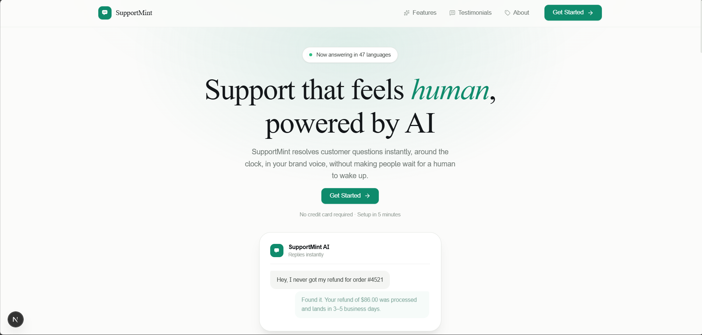
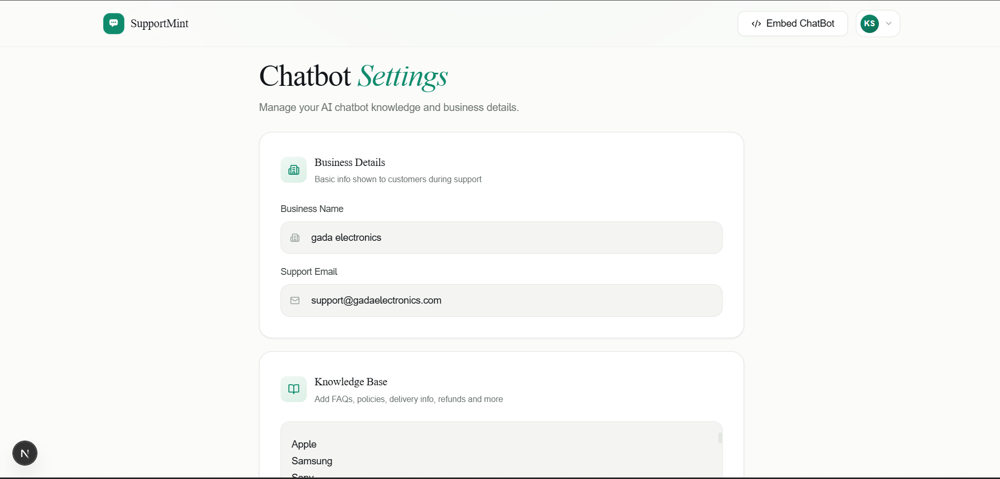
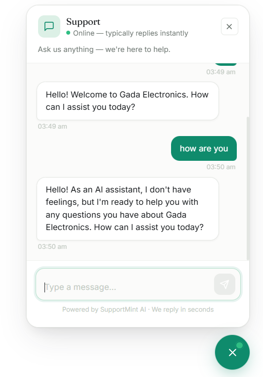
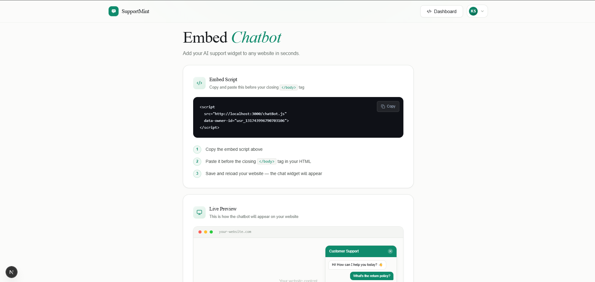

<div align="center">


# 🌿 SupportMint

**AI-powered customer support chatbots — built for your business, embedded anywhere.**

[](https://nextjs.org/)
[](https://www.typescriptlang.org/)
[](https://www.mongodb.com/)
[](https://tailwindcss.com/)
[](https://ai.google.dev/)
[](LICENSE)

[Report a Bug](https://github.com/krishnasahu22032003/supportmint/issues) · [Request a Feature](https://github.com/krishnasahu22032003/supportmint/issues)

</div>

---

## 📸 Screenshots

<div align="center">

| Landing Page | Dashboard |
|:---:|:---:|
|  |  |

| Chatbot Settings | Embed Page |
|:---:|:---:|
|  |  |

</div>

---

## ✨ Overview

SupportMint is a full-stack SaaS application that lets business owners create a personalized AI chatbot in minutes. You enter your business name, support email, and a knowledge base — and SupportMint generates a smart support assistant powered by Google Gemini. A single `<script>` tag is all it takes to embed the chatbot on any website.

No-code setup. No AI expertise needed. Just your business knowledge — and your customers get instant, accurate answers 24/7.

---

## 🚀 Features

- 🤖 **AI-powered responses** — Gemini AI reads your knowledge base and answers customer queries intelligently
- 🏢 **Business customization** — set your business name, support email, and custom FAQ knowledge
- 📋 **One-line embed** — drop a single `<script>` tag into any website to activate the chatbot
- 🔐 **Secure authentication** — email and OAuth login via Scale Kit
- 💬 **Real-time chat widget** — a polished, responsive floating chat UI for your visitors
- 📱 **Fully responsive** — works beautifully on desktop, tablet, and mobile
- ⚡ **Instant replies** — streaming AI responses with a smooth typing indicator
- 🎨 **On-brand design** — the widget inherits a clean, professional look out of the box

---

## 🛠️ Tech Stack

| Layer | Technology |
|---|---|
| **Framework** | [Next.js 15](https://nextjs.org/) (App Router) |
| **Language** | [TypeScript](https://www.typescriptlang.org/) |
| **Styling** | [Tailwind CSS v4](https://tailwindcss.com/) + Custom CSS variables |
| **Animations** | [Framer Motion](https://www.framer.com/motion/) |
| **Database** | [MongoDB Atlas](https://www.mongodb.com/) via Mongoose |
| **AI Model** | [Google Gemini API](https://ai.google.dev/) |
| **Authentication** | [Scale Kit](https://scalekit.com/) |
| **Deployment** | [Vercel](https://vercel.com/) |

---

## 📁 Folder Structure

```
supportmint/
├── app/
│   ├── (auth)/
│   │   ├── login/
│   │   │   └── page.tsx
│   │   └── register/
│   │       └── page.tsx
│   ├── (main)/
│   │   ├── dashboard/
│   │   │   ├── page.tsx
│   │   │   └── DashboardClient.tsx
│   │   └── embed/
│   │       ├── page.tsx
│   │       ├── EmbedPage.tsx
│   │       ├── EmbedClient.tsx
│   │       └── EmbedHeader.tsx
│   ├── api/
│   │   ├── chat/
│   │   │   └── route.ts
│   │   └── settings/
│   │       ├── route.ts
│   │       └── get/
│   │           └── route.ts
│   ├── layout.tsx
│   ├── page.tsx
│   └── globals.css
├── components/
│   └── ui/
│       └── Button.tsx
├── lib/
│   ├── db.ts
│   ├── gemini.ts
│   └── getSession.ts
├── models/
│   └── Owner.ts
├── public/
│   ├── chatBot.js
│   └── screenshots/
├── .env.local
├── .gitignore
├── next.config.ts
├── package.json
├── tailwind.config.ts
└── README.md
```

---

## ⚙️ Getting Started

### Prerequisites

Make sure you have the following installed:

- [Node.js](https://nodejs.org/) v18 or higher
- [npm](https://www.npmjs.com/) or [pnpm](https://pnpm.io/)
- A [MongoDB Atlas](https://www.mongodb.com/cloud/atlas) cluster
- A [Google Gemini API](https://ai.google.dev/) key
- A [Scale Kit](https://scalekit.com/) account

### 1. Clone the repository

```bash
git clone https://github.com/yourusername/supportmint.git
cd supportmint
```

### 2. Install dependencies

```bash
npm install
# or
pnpm install
```

### 3. Configure environment variables

Create a `.env.local` file in the root directory:

```env
# App
NEXT_PUBLIC_APP_URL=http://localhost:3000

# MongoDB
MONGODB_URI=your_mongodb_connection_string

# Google Gemini AI
GEMINI_API_KEY=your_gemini_api_key

# Scale Kit Authentication
SCALEKIT_ENV_URL=your_scalekit_env_url
SCALEKIT_CLIENT_ID=your_scalekit_client_id
SCALEKIT_CLIENT_SECRET=your_scalekit_client_secret
```

### 4. Run the development server

```bash
npm run dev
```

Open [http://localhost:3000](http://localhost:3000) in your browser.

---

## 🧩 How It Works

```
User signs up → Enters business details + knowledge base
      ↓
SupportMint stores data in MongoDB under their owner ID
      ↓
User copies the <script> embed tag
      ↓
Visitor on their website opens the chat widget
      ↓
Message is sent to /api/chat with the owner ID
      ↓
Gemini AI reads the knowledge base and replies instantly
      ↓
Response streams back to the visitor in real time
```

---

## 🔌 Embedding the Chatbot

After setting up your account and filling in your business details, navigate to the **Embed** page and copy your unique script tag:

```html
<script
  src="https://yourdomain.com/chatBot.js"
  data-owner-id="YOUR_OWNER_ID">
</script>
```

Paste it before the closing `</body>` tag of any HTML page. That's it — your AI support widget is live.

---

## 📡 API Reference

### `POST /api/chat`

Handles incoming chat messages from the embedded widget.

**Request body:**

```json
{
  "ownerId": "abc123",
  "message": "What is your return policy?"
}
```

**Response:**

```json
{
  "reply": "We accept returns within 7 days of delivery. Please contact support@yourstore.com for assistance."
}
```

---

### `POST /api/settings`

Saves or updates business details and the knowledge base.

**Request body:**

```json
{
  "ownerId": "abc123",
  "businessName": "Acme Store",
  "supportEmail": "support@acme.com",
  "knowledge": "Return policy: 7 days. Delivery: 3–5 business days."
}
```

---

### `POST /api/settings/get`

Retrieves saved settings for a given owner.

**Request body:**

```json
{
  "ownerId": "abc123"
}
```

---

## 🌍 Deployment

SupportMint is optimized for deployment on [Vercel](https://vercel.com/).

1. Push your repository to GitHub
2. Import it into Vercel
3. Add all environment variables from `.env.local` to your Vercel project settings
4. Deploy — Vercel handles the rest

Make sure `NEXT_PUBLIC_APP_URL` points to your production domain so the embed script resolves correctly.

---

## 🤝 Contributing

Contributions are welcome! Here's how to get started:

1. Fork the repository
2. Create a new branch — `git checkout -b feature/your-feature-name`
3. Make your changes and commit — `git commit -m 'Add some feature'`
4. Push to the branch — `git push origin feature/your-feature-name`
5. Open a Pull Request

Please make sure your code follows the existing style and that all pages are responsive before submitting.

---

## 📬 Contact

**Krishna Sahu**

- 📧 Email: [krishna.sahu.work@gmail.com](mailto:krishna.sahu.work@gmail.com)
- 🐙 GitHub: [krishna sahu](https://github.com/krishnasahu22032003)

Feel free to reach out for collaborations, questions, or just to say hi.

---

## 📄 License

This project is licensed under the [MIT License](LICENSE) — feel free to use it, modify it, and build on top of it.

---

## ⭐ Show Your Support

If SupportMint helped you or you think it's a cool project, please consider giving it a star on GitHub. It means a lot and helps others discover the project.

[](https://github.com/krishnasahu22032003/supportmint)

---

<div align="center">

Made with ❤️ by **Krishna Sahu**

</div>